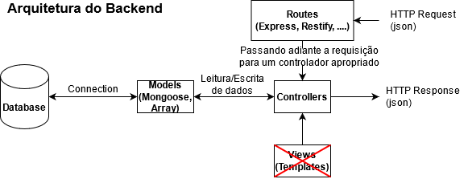

# API - GERENCIAMENTO BIBLIOTECA

Está é uma api com funcionalidades para que uma biblioteca realize o gereciamento de seus livros.

## Modelagem de Dados

## Arquiteura

## Links

- https://nodejs.org/en
- https://expressjs.com
- https://www.digitalocean.com/community/tutorials/workflow-nodemon-pt
- https://www.mongodb.com/pt-br/cloud/atlas/register
- https://www.npmjs.com/package/dotenv
- https://mongoosejs.com
- https://github.com/jquense/yup
## pacote cors - CORS é um mecanismo de segurança implementado pelos navegadores da web que controla as solicitações HTTP entre diferentes origens (domínios).
- https://www.npmjs.com/package/cors